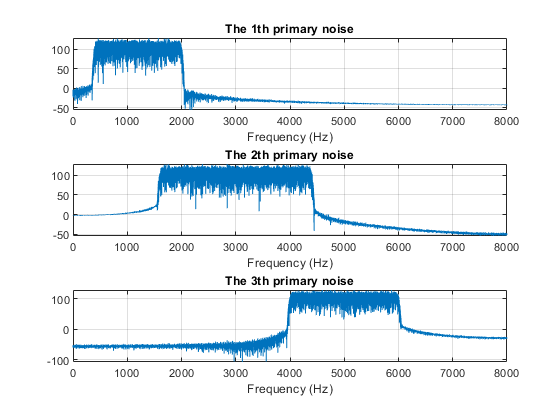
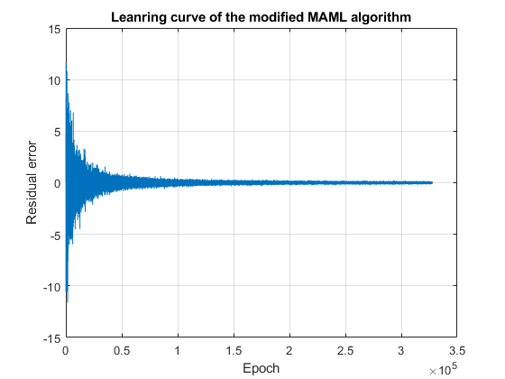
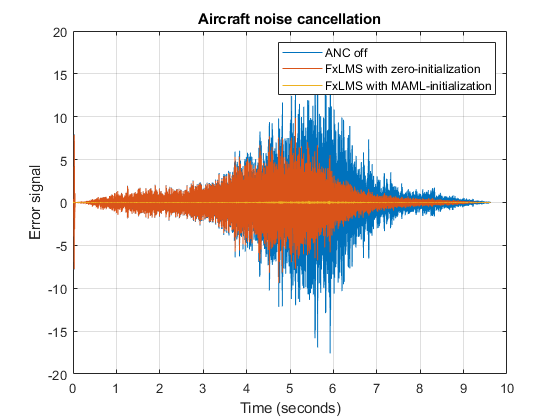

# Model-Agnostic Meta-Learning (MAML) for Adaptive Filter

This document describes the process and findings of testing the MAML algorithm for enhancing the convergence of the FxLMS algorithm in noise cancellation applications, specifically targeting aircraft noise.

## Introduction

The purpose of this test is to evaluate the Modified MAML (Model-Agnostic Meta-Learning) algorithm's effectiveness in initializing control filters for noise cancellation.

The entire progress of the modified MAML algorithm is shown in Figure 1. This MAML algorithm contains the following steps:
- Building the input vectors from the randomly sampled pair: $\{\mathbf{x}^\prime(n), \mathbf{d}(n)\}$. Here, $k=n$
$$    \begin{equation}
        \begin{cases}
        \mathbf{x}^\prime(k-i)&=\begin{bmatrix}x'(n-i)&x'(n-i-1)&\cdots&\mathbf{0}\_{1\times i}\end{bmatrix}^\mathrm{T}\\ d(k-i)&=d(n-i)\\ i&=0,1,\cdots,N-1\\
        \end{cases}\tag{A1}
    \end{equation}$$

- Get the error signal based on the initial control:
$$\begin{equation}e^\dag(k)=d(k)-\mathbf{\Phi}^\mathrm{T}(n)\mathbf{x}^\prime(k)\tag{A2}\end{equation}$$

- Obtain the control filter:
$$    \begin{equation}
        \mathbf{w}(n) = \mathbf{\Phi}(n)+\mu e^\dag(k)\mathbf{x}^\prime(k) \tag{A3}
    \end{equation}$$

- Get the error signal based on the new control filter:
$$    \begin{equation}
        e(k-i)=d(k-i)-\mathbf{w}^\mathrm{T}(n)\mathbf{x}^\prime (k-i) \tag{A4}
    \end{equation}$$

- Update the initial value :
$$    \begin{equation}
            \mathbf{\Phi}(n+1)	=  	\mathbf{\Phi}(n) +\varepsilon\sum_{i=0}^{N-1}\lambda^i e(k-i)\mathbf{x}^\prime(k-i) \tag{A5}
    \end{equation} $$


  

Figure 1: Block diagram of the modified MAML algorithm progress.

## Code Explanation
- [`Main_tst_function.m`](#the-explanation-of-main_tst_functionm): the main function is utilized to test the proposed modified MAML algorithm.  
- [`MAML_Nstep_forget.m`](#the-explanation-of-maml_nstep_forgetm): the matlab code of the modified MAML algorithm.
- [`FxLMS.m`](#the-explanation-of-fxlmsm): the matlab code of the FxLMS algorithm.
- `707_Sound_for_Simulation.mat`: the raw data of an aircrat noise.
- `\path`: the measured primary and secondary paths. 

---
### The explanation of `Main_tst_function.m`

The following code snippet offers a concise overview of `Main_tst_function.m`, which serves as the main function for evaluating the effectiveness of the proposed MAML method. For this numerical simulation, three distinct broadband sounds are utilized to train the MAML algorithm and obtain a single initial control filter. Subsequently, the aforementioned initial control is employed within an FxLMS algorithm to effectively eliminate actual aircraft noise. In comparison to zero initialization, the MAML technique can significantly enhance the convergence speed of the conventional FxLMS approach.  

### Contents:
- [Clean the memory and worksapace](#clean-the-memory-and-worksapace)
- [Configure the system simulation condition](#configure-the-system-simulation-condition)  
- [Build the broad band noise for training set](#build-the-broad-band-noise-for-training-set)
- [Randomly sampling the noise tracks to build dataset for the MAML algorithm](#randomly-sampling-the-noise-tracks-to-build-dataset-for-the-maml-algorithm)
- [Using Modified MAML algorithm to get the best initial control filter](#using-modified-maml-algorithm-to-get-the-best-initial-control-filter)
- [Testing aircraft noise cancellation by using MAML initial control filter](#testing-aircraft-noise-cancellation-by-using-maml-initial-control-filter)

#### Clean the memory and worksapace
Code snippet to clean workspace and set initial conditions.
```matlab
%% Clean the memory and worksapace 
close all ;
clear     ;
clc       ;
```
#### Configure the system simulation condition
This code snippet provides the system configuration for the numerical simulation. In this program, $f\_s$ and $T$ denote the system sampling rate and the simulation duration, respectively. $Len\_N$ repesents the length of the control filter. 

| Para  | Definition                   | Para | Definition          |
|-------|------------------------------|------|---------------------|
| fs    | Sampling rate                | T    | Simulation duration |
| Len_N | Length of the control filter |      |                     |

```matlab
%% Configure the system simulation condition 
fs  =   16000    ; % The system sampling rate.
T   =   3        ; % The duration of the simulation.
t   =   0:1/fs:T ; 
N   =   length(t); % The number of the data.

Len_N = 512      ; % Seting the length of the control filter.
%<<===Progress bar===>> 
f = waitbar(0,'Please wait...');
pause(.5)
```

#### Build the broad band noise for training set
 This section of the program produces filtered references, disturbances, and primary noises. These are then used in the modified MAML algorithm to obtain the initial control filter. The main sounds consist of three distinct broadband noises, as depicted in Figure S1.   

| Para     | Definition                     | Para      | Definition                 |
|----------|--------------------------------|-----------|----------------------------|
| Pri_path | Primary path                   | Track_num | Number of the noise tracks |
| Pri_n    | n-th primary noise             | Dis_n     | n-th disturbance           |
| Rf_n     | n-th filtered reference vector |           |                            |

```matlab
%% Build the broad band noise for training set
%<<===Progress bar===>> 
waitbar(0.25,f,'Build the broad band noise for training set');
pause(1)
%<<===Progress bar===>> 
% Loading path 
load('path\P1.mat')    ;
load('path\S11.mat')   ;
Pri_path = conv(P1,S11);

Track_num = 3         ; % Seting the number of the track for the trainning noise. 
if exist('Primary_noise.mat', 'file') == 2
    disp('Primary_noise exists in the current path.\n');
    % Loading the primary noise 
    load('Primary_noise.mat');
    load('Disturbance.mat')  ;
    load('Reference.mat')    ;
else
Noise     = randn(N,1);
% filter 
filter_1 = fir1(512,[0.05 0.25]);
filter_2 = fir1(512,[0.20 0.55]) ;
filter_3 = fir1(512,[0.5,0.75]) ;
% Primary noise 
Pri_1 = filter(filter_1,1,Noise) ;
Pri_2 = filter(filter_2,1,Noise) ;
Pri_3 = filter(filter_3,1,Noise) ;
% Drawing fiture 
data = [Pri_1,Pri_2,Pri_3];
figure ;
len_fft = length(Pri_1)   ;
len_hal = round(len_fft/2);
title('Frequency spectrum of primary noises')
for ii = 1:3
    freq = 20*log(abs(fft(data(:,ii))));
    subplot(3,1,ii);
    plot(0:(fs/len_fft):(len_hal-1)*(fs/len_fft), freq(1:len_hal));
    grid on   ;
    title("The "+num2str(ii)+"th primary noise")
    xlabel('Frequency (Hz)')
end
% Save primary noise into workspace 
save('Primary_noise.mat','Pri_1','Pri_2','Pri_3');
% Generating Distrubance 
Dis_1 = filter(Pri_path,1,Pri_1);
Dis_2 = filter(Pri_path,1,Pri_2);
Dis_3 = filter(Pri_path,1,Pri_3);
% Save distrubancec into workspace 
save('Disturbance.mat','Dis_1','Dis_2','Dis_3');
% Genrating Filtered reference signal 
Rf_1 = filter(S11,1,Pri_1);
Rf_2 = filter(S11,1,Pri_2);
Rf_3 = filter(S11,1,Pri_3);
% Save filter reference signal into workspace 
save('Reference.mat','Rf_1','Rf_2','Rf_3');
end
```

  
Figure S1: The frequency spectrum of the primary noises for the MAML algorithm.

#### Randomly sampling the noise tracks to build dataset for the MAML algorithm

This part of the program randomly samples the previously generated three types of noise tracks and their corresponding reference signals and disturbances to form the dataset. The length of the sampled vector equals that of the control filter, and these samples will be used in the proposed MAML algorithm to get the best initial control filter. 


| Parameter | Definition               | Parameter | Definition               |
|-----------|--------------------------|-----------|--------------------------|
| N\_epcho  | Number of training epoch | Di\_data  | Disturbance matrix       |
| Fx\_data  | Reference signal matrix  | Trac      | Randomly sampling matrix |

```matlab
%% Radomly sampling the noise tracks to build dataset for the MAML algorithm
%<<===Progress bar===>> 
waitbar(0.5,f,'Radomly sampling the noise tracks to build dataset for the MAML algorithm');
pause(1)
%<<===Progress bar===>> 
if exist('Sampe_data_N_set.mat', 'file') == 2
    disp('Sampe_data_N_set in the current path.\n');
    load('Sampe_data_N_set.mat');
else
N_epcho  = 4096 * 80                   ; % Setting the number of the epcho 
Trac     = randi(Track_num,[N_epcho,1]); % Randomly choosing the different tracks. 
Len_data = length(Dis_1)               ;
% Seting the N steps 
len   = 2*Len_N -1 ;
Fx_data = zeros(Len_N,N_epcho);
Di_data = zeros(Len_N,N_epcho);
Ref_data = [Rf_1,Rf_2,Rf_3]   ;
Dis_data = [Dis_1,Dis_2,Dis_3];
for jj = 1:N_epcho
    End = randi([len,Len_data]);
    Di_data(:,jj) = Dis_data(End-511:End,Trac(jj));
    Fx_data(:,jj) = Ref_data(End-511:End,Trac(jj));
end
save('Sampe_data_N_set.mat','Di_data','Fx_data');
end
```

#### Using Modified MAML algorithm to get the best initial control filter

This segment of the program applies the proposed modified MAML algorithm to compute the best initial control filter for the conventional FxLMS algorithm.  The step size of the FxLMS algorithm, the learning rate of the MAML algorithm, and the forgetting factor are set to $0.003$, $0.5$, and $0.99$, respectively. Figure S2 illustrates the proposed MAML algorithm's learning curve and demonstrates the proposed algorithm's convergence.

| Parameter | Definition                   | Parameter | Definition            |
|-----------|------------------------------|-----------|-----------------------|
| N         | Number of samples in Dataset | Er        | Residual error vector |
| mu        | Step size                    | lamda     | Forgetting factor     |
| epslon    | Learning rate of MAML        | Wc        | Control filter        |
| Phi       | Initial control filter       |           |                       |

```matlab
%<<===Progress bar===>> 
waitbar(0.75,f,'Using Modified MAML algorithm to get the best initial control filter');
pause(1)
%<<===Progress bar===>> 
if exist('Weigth_initiate_Nstep_forget.mat', 'file') == 2
    disp('Weigth_initiate_Nstep_forget in the current path.\n');
    load('Weigth_initiate_Nstep_forget.mat');
else
% Create a MAML algorithm
a  = MAML_Nstep_forget(Len_N);
N  = size(Di_data,2)         ; % The number of the sample in training set.
Er = zeros(N,1)              ; % Residual error vector
% Seting the step size for the embeded FxLMS algorithm 
mu    = 0.0003              ;
% Seting the forget factor 
lamda = 0.99                ;
% Seting the learning for MAML 
epslon = 0.5 ;
% Runing the MAML algorithm 
for jj = 1:N
    [a, Er(jj)] = a.MAML_initial(Fx_data(:,jj),Di_data(:,jj),mu,lamda,epslon);
end
% Drawing the residual error of the Modified MAML algorihtm 
figure    ;
plot(Er)  ;
grid on   ;
title('Leanring curve of the modified MAML algorithm');
xlabel('Epoch');
ylabel('Residual error');
% Getting the optimal intial control filter
Wc = a.Phi ;
% Saving the best initial control filter into workspace
save('Weigth_initiate_Nstep_forget.mat','Wc');
end
```

   
Figure S2: The learning curve of the modified MAML algorithm.

#### Testing aircraft noise cancellation by using MAML initial control filter

The program employs the FxLMS algorithms, utilizing zero initialization and MAML initialization, to reduce the impact of aircraft noise. Figure S3 illustrates the error signal produced by the FxLMS algorithm during both the on and off states. It has been observed that the utilization of MAML initialization significantly enhances the convergence rate of the adaptive algorithm in comparison to the conventional zero initialization approach. 

| Parameter | Definition         | Parameter  | Definition                                     |
|-----------|--------------------|------------|------------------------------------------------|
| Pri_1     | Primary noise      | Dis_1      | Disturbance                                    |
| Rf_1      | Reference signal   | Wc_initial | Initial control filter                         |
| muw       | Step size          | Er         | Error signal of FxLMS with zero-initialization |
| Wc        | MAML initial value | Er_1       | Error signal of FxLMS with MAML-initialization |

```matlab
%% Testing aircraft noise cancellation by using MAML initial control filter 
%<<===Progress bar===>> 
waitbar(0.95,f,'Testing aircraft noise cancellation by using MAML initial control filter');
pause(1)
%<<===Progress bar===>> 
% Loading aricrat noise data 
aircrat = load('707_Sound_for_Simulation.mat');
% Building primary noise
Pri_1   = aircrat.PilingNoise(1:153945)       ; 
% Generating the disturbacne 
Dis_1   = filter(Pri_path,1,Pri_1)            ;
% Generating the filter reference             
Rf_1    = filter(S11,1,Pri_1)                 ;
% Runging the FxLMS with the zero-initialization control filter    
Wc_initial = zeros(Len_N,1);
muw        = 0.00001 ; % Step size of All FxLMS algorithms. 
Er         = FxLMS(Len_N, Wc_initial, Dis_1, Rf_1, muw);
% Runging the FxLMS with the MAML-initialization control filter    
Wc_initial = Wc;
Er1        = FxLMS(Len_N, Wc_initial, Dis_1, Rf_1, muw);
figure 
% Drawing the figures of the MAML and FxLMS 
plot((0:length(Dis_1)-1)*(1/fs),Dis_1,(0:length(Er)-1)*(1/fs),Er,(0:length(Er1)-1)*(1/fs),Er1);
title('Aircraft noise cancellation')
xlabel('Time (seconds)')
ylabel('Error signal')
legend({'ANC off','FxLMS with zero-initialization','FxLMS with MAML-initialization'})
grid on;
%<<===Progress bar===>> 
waitbar(1,f,'Finishing');
pause(1)
%<<===Progress bar===>> 
%-------------------------------end----------------------------------------
```

  
Figure S3: Aircraft noise reduction performance of the FxLMS algorithms with the zero and MAML initializations. 

---
### The explanation of `MAML_Nstep_forget.m`


The provided code segment executes the modified MAML algorithm as outlined in Table I. The random sampling method is completed during dataset preparation. The code provided fully implements steps 4 to 7, and these steps are clearly described in the comments of the code.  

| Para   | Definition                | Para  | Definition               |
|--------|---------------------------|-------|--------------------------|
| Phi    | Initial control filter    | len_c | Length of control filter |
| Fx     | Filtered reference vector | Di    | Disturbance vector       |
| Grad   | Gradient accumulator      | Er    | Error signal             |
| mu     | Stepsize of FxLMS         | lamda | Forgetting factor        |
| epslon | Learning rate of MAML     |       |                          |
| Li     | Length of control filter  | e     | error signal             |

```matlab
%     __  ___          ___ _____          __   __  ______     __  _____
%    /  |/  /___  ____/ (_) __(_)__  ____/ /  /  |/  /   |   /  |/  / /
%   / /|_/ / __ \/ __  / / /_/ / _ \/ __  /  / /|_/ / /| |  / /|_/ / /
%  / /  / / /_/ / /_/ / / __/ /  __/ /_/ /  / /  / / ___ | / /  / / /___
% /_/  /_/\____/\__,_/_/_/ /_/\___/\__,_/  /_/  /_/_/  |_|/_/  /_/_____/

%% Title: Modified MAML algorithm for intializing the FxLMS algorithm 
% Author: DONGYAN SHI(DSHI003@ntu.edu.sg)
% Date  : 2020-10-1
%--------------------------------------------------------------------------
%% Introduction
% This modified MAML algorithm is used to get the initiailization for
% the FxLMS algorthm, and it can significanly improve the convergence of 
% of the conventional FxLMS algorithm. The code refers to the Table 1
% in [1]. Note: the Randomly sampling processing have been done in 
% Dataset preparing stage.  
%--------------------------------------------------------------------------
%% Reference 
% [1] Shi, Dongyuan, Woon-Seng Gan, Bhan Lam, and Kenneth Ooi. 
% "Fast adaptive active noise control based on modified model-agnostic meta-learning algorithm." 
% IEEE Signal Processing Letters 28 (2021): 593-597.

%% Modified MAML algorithm
classdef MAML_Nstep_forget
    properties 
        Phi % The initial control filter 
    end
    methods 
        function obj = MAML_Nstep_forget(len_c)
            % len_c : the lenght of control filter 
            obj.Phi = zeros(len_c,1);
        end
        function [obj,Er] = MAML_initial(obj,Fx,Di,mu,lamda,epslon)
            % Fx : the filtered reference vector 
            % Di : the disturbance vector  
            % mu : the step size 
            % lamda : the forget factor 
            Fx   = flipud(Fx);
            Dis  = flipud(Di); 
            Grad = 0; % Temporal gradiant accumlator 
            Er   = 0; % Training error signal 
            Li   = length(obj.Phi) ; % The length of the control filter in the FxLMS algorithm. 
			%<-4-> Get the error signal based on the initial control filter. 
			e    = Dis(1)  - obj.Phi'*Fx; 
			%<-5-> Obtain the control filter
            Wo   = obj.Phi + mu*e*Fx    ; % One-step updation for the assumed optimal control filter.
            for jj = 1:Li
                Fd   = [Fx(jj:end);zeros(jj-1,1)];
				%<-6-> Get the error signal based on the new control filter.
                e    = Dis(jj) - Wo'*Fd          ; 
				% Get the gradints based on the assumed optimal control filter 
                Grad = Grad    + epslon*(mu/Li)*e*Fd*(lamda^(jj-1)); 
                if jj == 1
                    Er =  e ;
                end
            end
			%%<-7-> Upate the initial value 
            obj.Phi = obj.Phi + Grad ;
        end
    end
    
end
%------------------------- end --------------------------------------------
```

---
### The explanation of `FxLMS.m`
This Matlab code implements the single-channel FxLMS approach, which is used to compare with the proposed MAML approach in the present investigation. To ensure simplicity, this program directly handles the filtered reference vector. 

| Para       | Definition               | Para       | Definition                |
|------------|--------------------------|------------|---------------------------|
| Len_Filter | Length of control filter | Wc_initial | Initial control filter    |
| Dis        | Disturbance vector       | Rf         | Filtered reference vector |
| muW        | Stepsize of FxLMS        | Er         | Error signal              |

```matlab
%  __________   ___  __      .___  ___.      _______.
% |   ____\  \ /  / |  |     |   \/   |     /       |
% |  |__   \  V  /  |  |     |  \  /  |    |   (----`
% |   __|   >   <   |  |     |  |\/|  |     \   \
% |  |     /  .  \  |  `----.|  |  |  | .----)   |
% |__|    /__/ \__\ |_______||__|  |__| |_______/

%% Title : The single-channel FxLMS algorithm 
% Author: DONGYAN SHI(DSHI003@ntu.edu.sg)
% Date  : 2020-10-1

%% single-channel FxLMS algorithm 
function Er = FxLMS(Len_Filter, Wc_initial, Dis, Rf, muw)
% Len_Filter : the length of the control filter 
% Wc_initial : the initial control filter 
% Dis        : the disturbance 
% Rf         : the filtered reference vector 
% muw        : the step size 
N   = Len_Filter ;
Wc  = Wc_initial ;
XD  = zeros(N,1) ;
Er  = zeros(length(Rf),1);
    for tt = 1:length(Rf) 
        XD   = [Rf(tt);XD(1:end-1)];
        Rf_i = XD'         ;
        Rf_i = Rf_i'       ;
        y_t  = Wc'*Rf_i    ;
        e    = Dis(tt)-y_t ;
        Er(tt) = e         ;
        Wc     = Wc + muw*e*Rf_i;
    end
end
%-------------------------end-----------------------------
```

## Summray 

A step-by-step guide to preparing the broadband noise for the training set, simulating the noise environment, and applying the MAML algorithm.

## Reference 
``` bibtex
@article{shi2021fast,
  title={Fast adaptive active noise control based on modified model-agnostic meta-learning algorithm},
  author={Shi, Dongyuan and Gan, Woon-Seng and Lam, Bhan and Ooi, Kenneth},
  journal={IEEE Signal Processing Letters},
  volume={28},
  pages={593--597},
  year={2021},
  publisher={IEEE}
}
```


